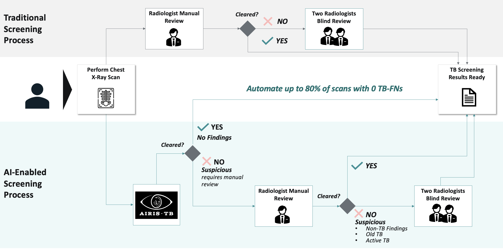

# AIRIS-TB: Population TB Screening on a Scale of 1M+ CXRs
---
This repository host the codebase related to the study: **"Population-scale Cross-sectional Observational Study for AI-powered TB Screening on One Million CXRs"** [(Link to Manuscript)](https://www.nature.com/articles/s41746-025-01832-7)

We developed AIRIS-TB to tackle the inefficiencies of traditional TB screening, which depends on manual chest X ray review by radiologists. Our model automatically clears normal CXRs and defers only abnormal cases for manual review, enabling up to 80% reduction in radiologist workload. Tested on over **one million scans, AIRIS-TB achieves 98.51% AUC with a 0% TB-FNR**, maintaining screening safety at scale.



With this public release we aim to promote transparency and reproducibility, and though we do not release internal training/testing data or model weights, we do provide prediction and target labels for four widely cited publicly available datasets which helped us to assess AIRIS-TB's generalization capabilities. With this, we allow others to compare and benchmark AIRIS-TB’s screening performance using same data. We also include utils.py, which contains the code to compute key metrics such as false negative rate (FNR) and workload reduction (WLR), which should facilitate consistent evaluations.

---

## Contents

This repository includes:
- Predictions on public datasets
- Performance metric scripts

The predictions on the 4 public datasets, [CheXpert test](https://github.com/rajpurkarlab/cheXpert-test-set-labels), [Chest-IU](https://openi.nlm.nih.gov/faq), [TB-11k](https://arxiv.org/abs/2307.02848) and [PadChest](https://bimcv.cipf.es/bimcv-projects/padchest/) obtained with our AIRIS-TB model can be found inside the folder `preds/`. The labels were binarized to normal/abnormal using the original labels for each dataset. In each CSV, the columns `preds`, `labels` contain th model's predictions and binarized labels respectively. 


To compute the metrics on each dataset:

Ensure you install the required packages:
```
pip install -r requirements.txt
```


The simply run:

```
sh run.sh
```

NOTE: The utils.py script contains all logic for computing performance metrics.

## Results

Below we evaluate the AIRIS-TB model on publicly available datasets using a safe-setting threshold which was chosen to balance FNR and WLR. For more specific details on threshold selection, please refer to our study: https://www.nature.com/articles/s41746-025-01832-7

| Dataset      | AUROC  | FNR |
|--------------|--------|-----|
| Internal Test (~1M CXRs) | 98.51% |0.33%|
| CheXpert     | 85.03% |0.00%| 
| ChestIU      | 65.32% |0.00%| 
| PadChest     | 78.97% |3.03%|
| TB-11k       | 87.97% |0.50%|  

---

## Contact

For any questions feel free to reach out at prateekmunjal31@gmail.com  or pmunjal@m42.ae

---